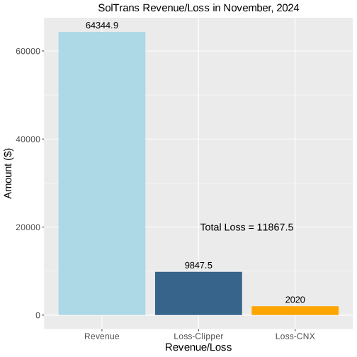

<!--

<h1> SolTrans Fare Calculation Errors </h1>
<h3> By Farhad Salemi </h3>

# Contents 

- [Introduction](#introduction)

- [Problem Identification](#problem-identification)

- [Methodology](#methodology)

- [Root Causes of Missing Route Names](#root-causes-of-missing-route-names)

- [Analysis and Findings](#analysis-and-findings)

- [Financial Impact](#financial-impact)

- [Route-Specific Analysis](#route-specific-analysis)

- [Recommendations](#recommendations)

- [Further Research](#further-research)

## Introduction

SolTrans employs a dual-fare system: a Regular Fare for standard routes
and an Express Fare for express routes. Express fares are set at 2.5
times the cost of regular fares. To ensure accurate fare calculation,
the Clipper system relies on route names to correctly identify each
transaction. Therefore, the presence of a valid route name is critical
for proper fare assessment.

## Problem Identification

An analysis of Clipper fare transactions for SolTrans revealed a
recurring issue: unknown route names occasionally appear in fare
transactions across all buses and routes. When this occurs, Clipper
assigns a default route name and applies the regular fare, regardless of
the actual route type. Consequently, transactions on express routes
lacking a valid route name are incorrectly charged at the lower regular
fare. While this issue affects transactions on both route types, the
resulting revenue loss is borne exclusively by SolTrans due to the
higher price point of express fares.

## Methodology

To understand the root causes of these missing route names, we conducted
a thorough analysis of SolTrans fare transaction data for November. This
analysis included:

-   **Overall Transaction Patterns:** Examining total Clipper fare
    transactions.

-   **Missing Route Name Incidents:** Identifying the frequency of
    transactions with missing route names (\"None\").

-   **Route Failures Analysis:** Analyzing the reasons for missing route
    names.

-   **Impact Analysis:** Evaluating the revenue loss due to missing
    route names, specifically on express routes.

-   **Hardware-Related Patterns:** Analyzing the frequency of missing
    route names per bus.

-   **Source of Failures:** Distributing failures between Clipper and
    Connexionz.

## Root Causes of Missing Route Names

Clipper receives route names from the Connexionz GPS equipment on buses
during each transaction. Our analysis has identified several
contributing factors for the missing route names:

1.  **Connexionz GPS Equipment Failures:**

    -   **Causes:** Intermittent cellular coverage loss, GPS hardware
        malfunctions, or Connexionz system outages can prevent the route
        ID from being transmitted to Clipper.

    -   **Recommendation:** Connexionz should implement measures to
        minimize these occurrences.

2.  **Trip Update Message Deficiencies:**

    -   **Issue:** Some trip update messages lack the necessary vehicle
        ID.

    -   **Frequency:** This occurred in approximately 1% of messages
        within our dataset.

    -   **Recommendation:** Connexionz should investigate and rectify
        these failures.

3.  **Clipper Fare Box Disconnection from Connexionz:**

    -   **Causes:** The Clipper fare box can disconnect from Connexionz
        due to:

        -   The fare box entering standby mode during extended bus
            idling.

        -   Hardware or software issues within the Clipper box (e.g.,
            certificate errors, firmware issues).

    -   **Impact:** When connection is lost, the current route
        information is also lost. While the system is supposed to
        reacquire the route ID upon reconnection, this does not always
        occur.

    -   **Recommendation:** A joint investigation by Connexionz and
        Clipper is needed to identify and resolve the underlying issues.

## Analysis and Findings

-   **Route Name Failures:** These graphs provide an overall view of the
    frequency of route name failures in month of November.

  

-   **Route Name Failures by Each Cause:** These graphs provide a
    comprehensive view of the frequency of failures by each cause.

  

-   **Hardware-Related Issues:** This analysis is essential to identify
    buses with recurring issues so that appropriate actions can be
    taken.

 

-   **Express Bus Failures:** This graph further highlights the impact
    of failures on express buses.

 

-   **Clipper vs. Connexionz Failures:** This separation helps identify
    areas of accountability and needed changes.

  

## Financial Impact

-   **Revenue and Losses:** The following figure shows the Graph of
    SolTrans Revenue and Losses in November, including contributing
    factors. This is a crucial figure that shows how the above failures
    translate to financial losses\*.

 

> *\*These loss estimates are conservative since losses for route 82
> were treated as an express route.*

## Route-Specific Analysis

-   **Fare Transactions per Route:** The following graph shows
    distribution of fare transactions per route, including missing route
    cases and their reasons. This helps understand the performance on
    the system by individual route.

 

## Recommendations

1.  **Connexionz System Improvement:** Implement strategies to minimize
    GPS and cellular connectivity issues and address the trip update
    message deficiencies.

2.  **Clipper System Improvement:** Investigate and resolve the root
    causes of Clipper fare box disconnections and their failure to
    reacquire route IDs.

3.  **Hardware Maintenance:** SolTrans should proactively identify and
    address hardware issues on buses experiencing frequent fare
    calculation errors.

4.  **Joint Investigation:** A collaborative approach by SolTrans,
    Connexionz, and Clipper is vital to identifying and resolving the
    fare calculation discrepancies.

## Further Research

-   **Real-Time Monitoring:** Implementing real-time monitoring of the
    connection between the Clipper fare box and the Connexionz system
    may identify and help mitigate issues more effectively.

-   **Data Logging:** Enhanced logging of errors within both systems
    will facilitate more efficient problem diagnosis and resolution.
    Despite multiple efforts to collect logs from Connexionz\'s Medius
    system and MQTT box, we were unable to obtain the required logs.
-->
